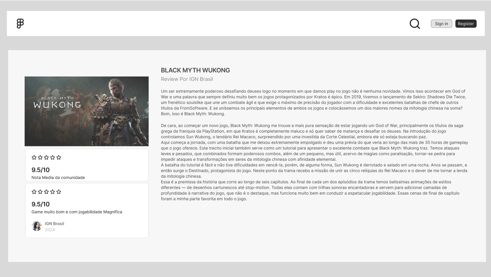

# Catalogo de jogos

### neste projeto é exibido uma pagina com jogos tanto atuais quando de epoca juntamente de seu preço.
### tambem conta com um sistema de pesquisa no cabeçario para que o usuario possa encontrar facilmente o jogo que busca

### Com as notas e comentarios profissionais, os usuarios conseguiram ter maior noção de como o jogo é, se ele é divertido para jogar, ver o preço em seus jogos e as lojas que estes jogos estão disponivel, já para os desenvolvedores pode ser de suma importancia essas analises, pois assim podem pensar em melhorar os seus lançamentos futuros e ter uma noção dos temas e estilos de jogos que estão populares no mercado.

### Os usuarios iram contribuir com sua nota de opinião pessoal e sera exibido a media da comunidade junta media profissional.
